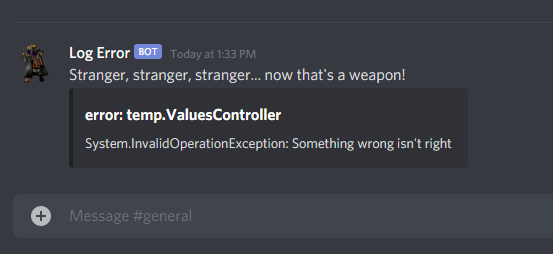

<h1 align="center">
  Merchant
</h1>

<p align="center">
  <a href="#rocket-project">Project</a>&nbsp;&nbsp;&nbsp;|&nbsp;&nbsp;&nbsp;
  <a href="#thinking-how-to-use">How to use</a>&nbsp;&nbsp;&nbsp;|&nbsp;&nbsp;&nbsp;
  <a href="#memo-license">License</a>
</p>

## :rocket: Project

This project is a logging provider for .NET core and ASP.NET core, which provides one way to be notified on Discord by the Merchant with one of his famous quotes always an error is dispatch using a logger.

### Preview

<p>
    
</p>

## :thinking: How to use

### Instalation

**Nuget**
```
Install-Package Merchant
```

**.NET CLI**
```
dotnet add package Merchant
```

### Adding the Merchant

```csharp
using Microsoft.AspNetCore.Hosting;
using Microsoft.Extensions.Hosting;
using Merchant;
using Microsoft.Extensions.Logging;

namespace temp
{
    public class Program
    {
        public static void Main(string[] args)
        {
            CreateHostBuilder(args).Build().Run();
        }

        public static IHostBuilder CreateHostBuilder(string[] args) =>
            Host.CreateDefaultBuilder(args)
                .ConfigureLogging(it =>
                {
                    it.ClearProviders();

                    it.AddConsole();

                    it.AddMerchant((config) =>
                    {
                        config.BotToken = "YOUR_BOT_TOKEN";
                        config.ChannelId = "YOUR_CHANNEL_ID";
                    });
                })
                .ConfigureWebHostDefaults(webBuilder =>
                {
                    webBuilder.UseStartup<Startup>();
                });
    }
}
```

### Logging something to Discord
```csharp
using System;
using Microsoft.Extensions.Logging;

namespace temp
{
    public class SomeService
    {
        private readonly ILogger<SomeService> _logger;

        public SomeService(ILogger<SomeService> _logger)
        {
            _logger = logger;
        }

        public void Execute()
        {
            try
            {
                // doing something...
            }
            catch(Exception ex)
            {
                _logger.LogError(ex.ToString());
            }
        }
    }
}
```

## :memo: License

This project is under the MIT license. See the file [LICENSE](LICENSE) for more information.
